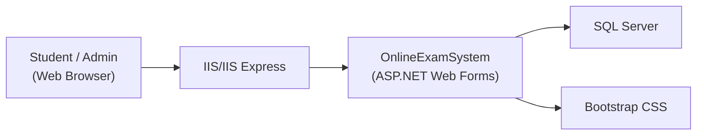
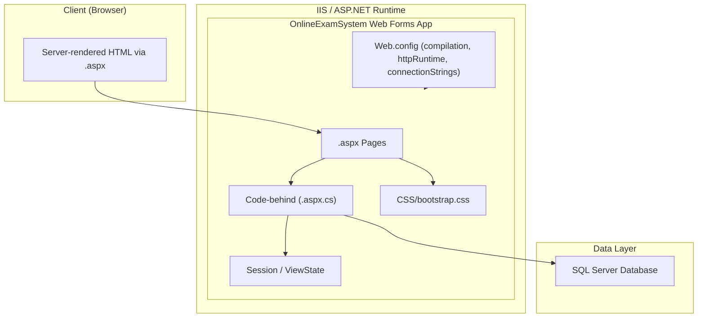
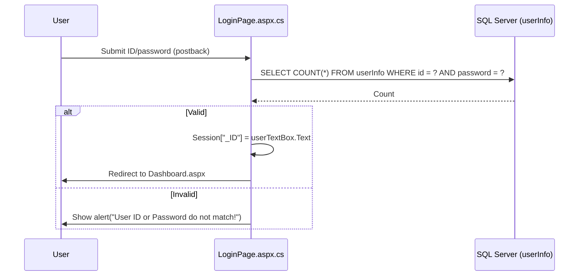
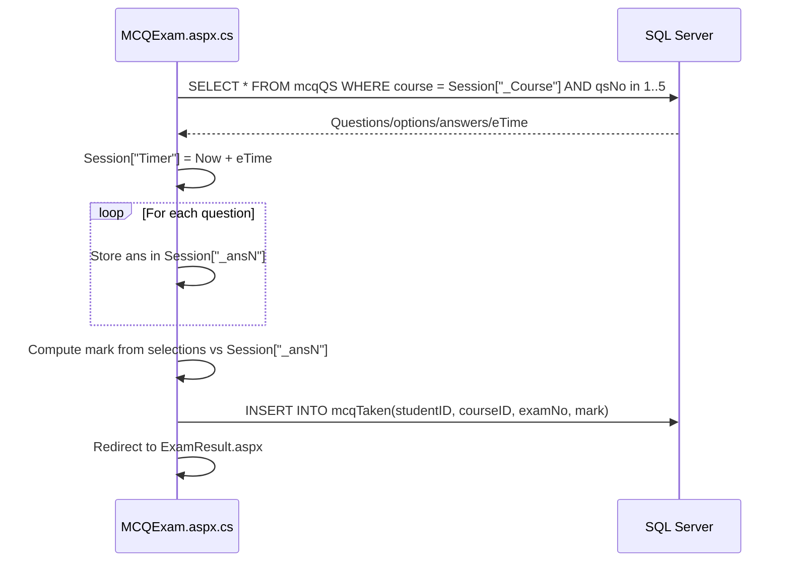
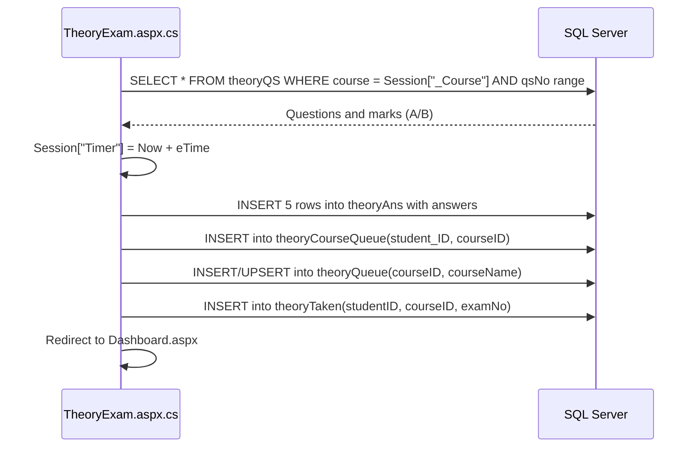
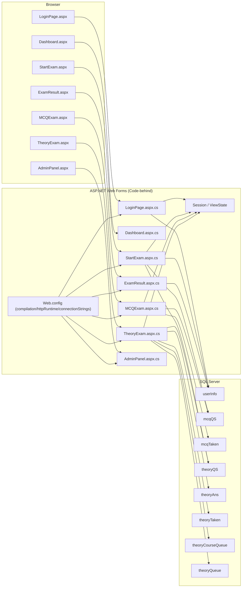

# Architecture and Flow

## High-Level Architecture
The application is a monolithic ASP.NET Web Forms site that serves both UI and server-side logic. It follows the standard Web Forms model with .aspx pages paired with code-behind files. Data is persisted to SQL Server. Styling is provided via Bootstrap.

### Components
- UI Pages (.aspx + .aspx.cs): Handle user interactions via server controls and postbacks.
- Business Logic (primarily within code-behind): Encapsulates workflows, such as the exam lifecycle, scoreboard updates, and admin operations.
- Data Access (ADO.NET from code-behind): Executes SQL statements against SQL Server using SqlConnection/SqlCommand. Current code constructs dynamic SQL and uses session state extensively.
- State Management: Session and ViewState, along with query strings for internal page routing and data handoff.
- Configuration: Web.config with compilation, httpRuntime, and connectionStrings.
- Styling: Bootstrap CSS shipped with the project.

### Diagram: System Context


### Diagram: Containers and Components


## Detailed Architecture Diagram
The following diagram shows the end-to-end flow across key pages, code-behind, session usage, and database interactions for login, exam start, MCQ and theory exams, and result recording.

```mermaid
flowchart LR
    subgraph Browser["Browser"]
        LoginUI["LoginPage.aspx"]
        DashboardUI["Dashboard.aspx"]
        StartExamUI["StartExam.aspx"]
        MCQUI["MCQExam.aspx"]
        TheoryUI["TheoryExam.aspx"]
        ResultUI["ExamResult.aspx"]
        AdminPanelUI["AdminPanel.aspx"]
    end

    subgraph Server["ASP.NET Web Forms (Code-behind)"]
        LoginCB["LoginPage.aspx.cs"]
        DashboardCB["Dashboard.aspx.cs"]
        StartExamCB["StartExam.aspx.cs"]
        MCQCB["MCQExam.aspx.cs"]
        TheoryCB["TheoryExam.aspx.cs"]
        ResultCB["ExamResult.aspx.cs"]
        AdminCB["AdminPanel.aspx.cs"]
        State["Session / ViewState"]
        Cfg["Web.config\n- compilation targetFramework=4.8\n- httpRuntime targetFramework=4.5.2\n- connectionStrings"]
    end

    subgraph Database["SQL Server"]
        UserInfo["userInfo"]
        McqQS["mcqQS"]
        McqTaken["mcqTaken"]
        TheoryQS["theoryQS"]
        TheoryAns["theoryAns"]
        TheoryTaken["theoryTaken"]
        TheoryCourseQueue["theoryCourseQueue"]
        TheoryQueue["theoryQueue"]
    end

    LoginUI --> LoginCB
    DashboardUI --> DashboardCB
    StartExamUI --> StartExamCB
    MCQUI --> MCQCB
    TheoryUI --> TheoryCB
    ResultUI --> ResultCB
    AdminPanelUI --> AdminCB

    Cfg --> LoginCB
    Cfg --> StartExamCB
    Cfg --> MCQCB
    Cfg --> TheoryCB
    Cfg --> ResultCB
    Cfg --> AdminCB

    %% Login flow
    LoginCB -- validate --> UserInfo
    LoginCB -- set Session["_ID"] --> State
    LoginCB -- success --> DashboardUI

    %% StartExam flow
    StartExamCB -- read Session["_ID"] --> State
    StartExamCB -- lookup semester --> UserInfo
    StartExamCB -- if Theory exists --> TheoryQS
    StartExamCB -- if MCQ exists --> McqQS
    StartExamCB -- set course & flags in session --> State
    StartExamCB -- navigate --> TheoryUI
    StartExamCB -- navigate --> MCQUI

    %% MCQ exam
    MCQCB -- load qs/ops --> McqQS
    MCQCB -- set answers in Session --> State
    MCQCB -- set Session["Timer"]=now+eTime --> State
    MCQCB -- submit: compute score & insert --> McqTaken
    MCQCB -- redirect --> ResultUI

    %% Theory exam
    TheoryCB -- load qs/marks --> TheoryQS
    TheoryCB -- set Session["Timer"]=now+eTime --> State
    TheoryCB -- submit: insert answers --> TheoryAns
    TheoryCB -- queue course --> TheoryCourseQueue
    TheoryCB -- upsert theoryQueue --> TheoryQueue
    TheoryCB -- mark exam taken --> TheoryTaken
    TheoryCB -- redirect --> DashboardUI

    %% Result
    ResultCB -- update profile/score --> UserInfo

    %% Admin Panel (navigation & queues)
    AdminCB -- navigates to edit/set pages --> Server
```

## Data Flow Scenarios

### User Authentication and Dashboard
Based on LoginPage.aspx.cs, student login validates against userInfo using a SqlConnection with a connection string from Web.config (placeholder strings in code). On success, Session["_ID"] is set and the request is redirected to Dashboard.aspx.



### Start Exam (Course Discovery and Availability)
From StartExam.aspx.cs, the code retrieves the semester for the logged-in student, populates available courses, and checks for MCQ or Theory exam availability via counts in mcqQS and theoryQS. It sets session variables for selected course and exam type and navigates to the appropriate page.

```mermaid
sequenceDiagram
    participant U as User
    participant S as StartExam.aspx.cs
    participant DB as SQL Server

    U->>S: Load page (with Session["_ID"])
    S->>DB: SELECT semester FROM userInfo WHERE id = Session["_ID"]
    DB-->>S: Semester
    S->>U: Populate course dropdown based on semester
    U->>S: Select Exam Type (MCQ/Theory) + Course
    alt MCQ
        S->>DB: SELECT COUNT(*) FROM mcqQS WHERE course = selected
        DB-->>S: Count
        alt exists
            S->>S: Session["_sMCRS"] = course; Session["_Course"] = course
            S->>U: Navigate to MCQExam.aspx
        else none
            S->>U: Alert("No MCQ Course Found!")
        end
    else Theory
        S->>DB: SELECT COUNT(*) FROM theoryQS WHERE course = selected
        DB-->>S: Count
        alt exists
            S->>S: Session["_sTCRS"] = course; Session["_Course"] = course
            S->>U: Navigate to TheoryExam.aspx
        else none
            S->>U: Alert("No Theory Course Found!")
        end
    end
```

### MCQ Exam Lifecycle
MCQExam.aspx.cs loads questions and options from mcqQS for the selected course, stores correct answers in session, sets a session-based timer using the question’s eTime, and on submission computes the score and inserts a row in mcqTaken, then redirects to ExamResult.aspx.



### Theory Exam Lifecycle and Queues
TheoryExam.aspx.cs loads pairs of theory questions with marks from theoryQS, sets a session timer, and upon submission inserts answers into theoryAns, enqueues the course in theoryCourseQueue and theoryQueue, marks the exam taken in theoryTaken, and returns the user to the dashboard.



## Design Considerations

### ViewState and Postbacks
The application uses server controls and postbacks on Web Forms pages. ViewState keeps page state between requests; avoid large objects to reduce payload. Use IsPostBack checks in Page_Load to separate initialization from postback logic, as seen in StartExam.aspx.cs.

### Session Usage
Session is the primary mechanism for tracking user identity, course selections, exam context, and timer state across postbacks and page navigations. Keys such as "_ID", "_Course", "_ansN", "_tMark", and "Timer" are used throughout MCQ and Theory exams and should be consistently managed and cleared at logout.

### Data Access and Security
Code-behind uses ADO.NET with SqlConnection and constructs SQL strings directly. Production-quality code should migrate to parameterized queries to prevent SQL injection, implement input validation and output encoding to mitigate XSS, and centralize configuration via Web.config connectionStrings.

### Timer Handling
Both MCQExam.aspx.cs and TheoryExam.aspx.cs set Session["Timer"] to a server-calculated cutoff using the eTime retrieved from questions. The Timer1_Tick events compare the current time against Session["Timer"] to update UI and enforce timeouts.

### Admin Flows and Queues
AdminPanel navigation routes to SetExam, EditExam, EditMCQ, and EditTheory. Theory answers are funneled into theoryCourseQueue and theoryQueue for grading. ShowAns.aspx supports answer review and marks assignment.

## Future Enhancements
- Introduce repository/service layers to decouple data access from UI code-behind.
- Replace dynamic SQL with parameterized commands and/or stored procedures.
- Centralize authentication/authorization checks and implement role-based authorization.
- Consider introducing Web API endpoints if future SPA or integrations are required.
- Harden timer logic against server restarts and enforce server-side submission windows.

## Glossary
- MCQ: Multiple Choice Questions
- Theory Exam: Free-form answers requiring manual evaluation
- Queue: Pending theory answers awaiting grading

## Standalone Diagram
A standalone Mermaid diagram is exported at docs/diagrams/architecture.mmd. This file can be opened in Mermaid-compatible tools or included in other documents.


Sources:
- Online-Examination-System-3411/OnlineExamSystem/Web.config
- Online-Examination-System-3411/OnlineExamSystem/LoginPage.aspx.cs
- Online-Examination-System-3411/OnlineExamSystem/StartExam.aspx.cs
- Online-Examination-System-3411/OnlineExamSystem/MCQExam.aspx.cs
- Online-Examination-System-3411/OnlineExamSystem/TheoryExam.aspx.cs
- Online-Examination-System-3411/README.md
- Online-Examination-System-3411/database-script/README.md
