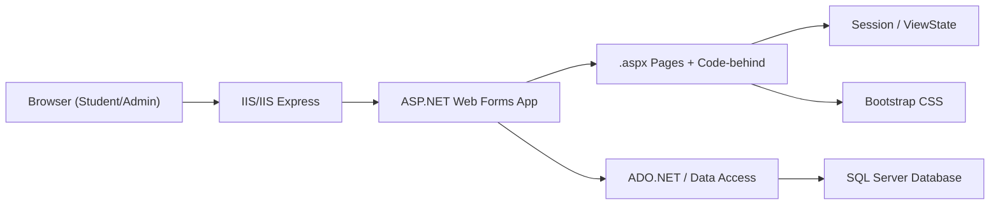
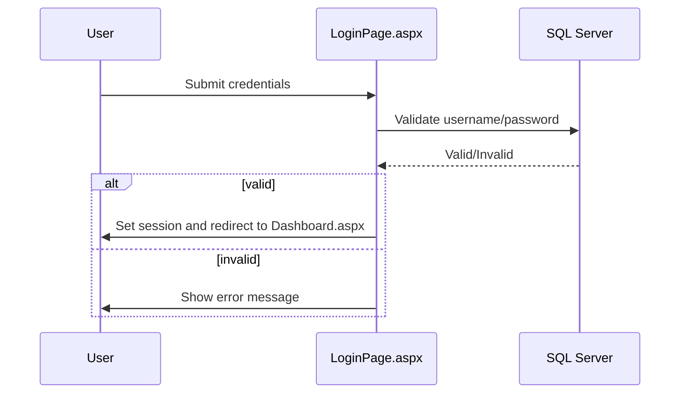
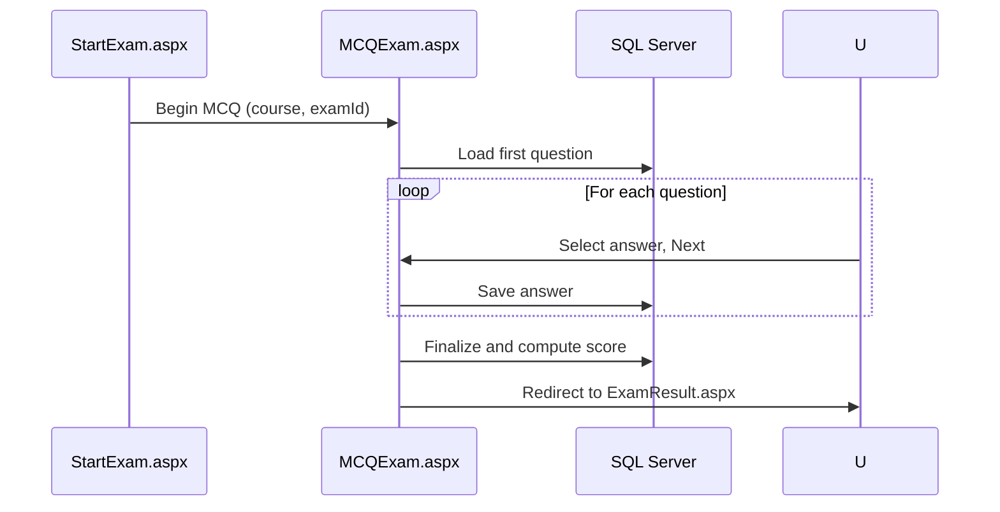
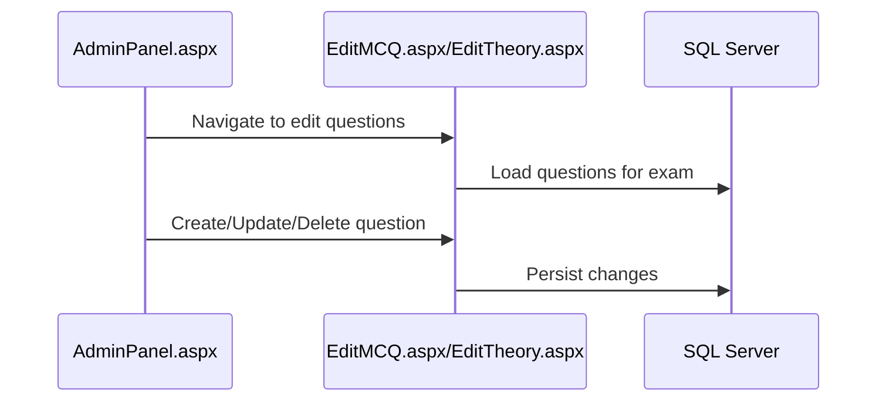

# Architecture and Flow

## High-Level Architecture
The application is a monolithic ASP.NET Web Forms site that serves both UI and server-side logic. It follows the standard Web Forms model with .aspx pages paired with code-behind files. Data is persisted to SQL Server. Styling is provided via Bootstrap.

### Components
- UI Pages (.aspx + .aspx.cs): Handle user interactions via server controls and postbacks.
- Business Logic (within code-behind, or future Services): Encapsulate workflows (exam lifecycle, evaluation).
- Data Access (ADO.NET within pages today; optional Repositories later): Execute parameterized SQL queries.
- State Management: Session, ViewState, and occasionally cookies or query strings.
- Configuration: Web.config with connectionStrings.
- Styling: Bootstrap CSS.

### Diagram: Container and Components

## Data Flow Scenarios

### User Authentication and Dashboard

### Exam Lifecycle (MCQ)

### Admin Flow (Question Management)

## Design Considerations

### ViewState and Postbacks
- ViewState stores page and control state between postbacks; avoid large objects to keep payload small.
- Use IsPostBack in Page_Load to separate initialization from postback logic.

### Session Usage
- Session stores user identity, current exam context, and timer metadata.
- Keep session keys consistent and documented; clear or invalidate on logout.

### Timer Handling
- Timers are session-backed with server-side checks on submission.
- Consider persisting remaining time for resiliency if server restarts are a concern.

### Security
- Validate all inputs; use parameterized queries.
- Encode outputs to avoid XSS.
- Restrict admin pages to authorized roles (e.g., check Session["isAdmin"]).

### PDF Generation
- DownloadPdf.aspx contains a code-behind placeholder.
- Implement using Crystal Reports or a .NET PDF library; document data sources and output paths.

## Future Enhancements
- Introduce Services/Repositories to decouple data access from UI.
- Add centralized authentication/authorization helpers.
- Implement Web API endpoints if integrating SPA or external clients.
- Improve timer robustness and client/server synchronization.

## Glossary
- MCQ: Multiple Choice Questions
- Theory Exam: Free-form answers requiring manual evaluation
- Queue: Pending theory answers awaiting grading
