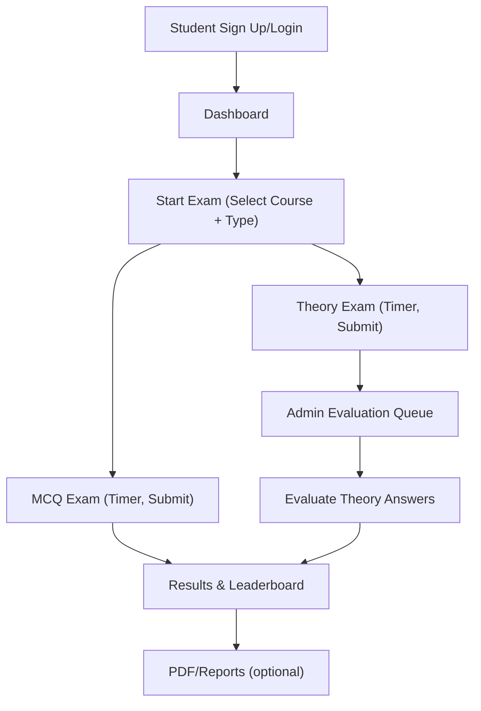

# Business Workflows

## Overview
This document describes the business workflows for the Online Examination System, clarifying roles, preconditions, main paths, alternate/exception paths, and the underlying system touchpoints. It is intended for product owners, developers, and administrators to align on end-to-end behavior.

- Roles:
  - Student: Registers, logs in, takes exams, views results.
  - Admin/Teacher: Creates and manages exams and questions, evaluates theory answers, oversees leaderboards.
- Core Systems:
  - ASP.NET Web Forms UI (aspx + code-behind)
  - SQL Server database (see database-script/Online-Examination-System-Databse-Script.sql)
  - Bootstrap-based UI styling

Related docs: Architecture.md, Interfaces.md, Configuration.md, ProjectStructure.md.

## High-Level Workflow Map

## Student Workflows

### 1. Registration and Login
- Preconditions:
  - Database is initialized; application is running.
- Steps:
  1. Student navigates to SignUpPage.aspx and submits registration details (optionally with profile image).
  2. Student navigates to LoginPage.aspx and enters credentials.
  3. On success, session is established and user is redirected to Dashboard.aspx.
- Exceptions:
  - Duplicate username → show validation error and request alternate username.
  - Password mismatch → request correction.
- System Touchpoints:
  - SignUpPage.aspx(.cs): insert user record into DB.
  - LoginPage.aspx(.cs): validate credentials, set Session["userId"], Session["semester"], etc.

### 2. Starting an Exam
- Preconditions:
  - Student is authenticated and on Dashboard.aspx.
- Steps:
  1. Student opens StartExam.aspx.
  2. Page loads available courses filtered by student’s semester.
  3. Student selects a course and exam type (MCQ or Theory).
  4. System verifies whether the student has already taken the exam.
  5. Redirect to MCQExam.aspx or TheoryExam.aspx.
- Exceptions:
  - Exam already taken → show message; disallow duplicate attempt.
  - No available exams for selected course → inform student.
- System Touchpoints:
  - StartExam.aspx(.cs): course binding, eligibility checks, redirect logic.

### 3. Taking an MCQ Exam
- Preconditions:
  - StartExam flow selected MCQ and established exam context in session.
- Steps:
  1. MCQExam.aspx loads the first question and starts the timer.
  2. Student selects an option and navigates to next question.
  3. On submit or when time expires, answers are saved and score is computed.
  4. Redirect to ExamResult.aspx.
- Exceptions:
  - Time expired → auto-submit and finalize.
  - Missing selection → prompt before navigating (if implemented).
- System Touchpoints:
  - MCQExam.aspx(.cs): question retrieval, timer, answer persistence.

### 4. Taking a Theory Exam
- Preconditions:
  - StartExam flow selected Theory and established exam context in session.
- Steps:
  1. TheoryExam.aspx loads the first question and starts the timer.
  2. Student types free-form answers and navigates through questions.
  3. On submit or when time expires, answers are stored for evaluation.
  4. Student may see a pending status until admin evaluation completes.
- Exceptions:
  - Time expired → auto-submit and finalize draft answers.
- System Touchpoints:
  - TheoryExam.aspx(.cs): question loading, timer, answer capture.

### 5. Viewing Results and Leaderboard
- Preconditions:
  - MCQ: score computed automatically.
  - Theory: evaluated by admin; marks updated.
- Steps:
  1. Student navigates to ExamResult.aspx to view scores.
  2. Student navigates to Leaderboard.aspx to see standings.
- System Touchpoints:
  - ExamResult.aspx(.cs): display results, may update profile totals.
  - Leaderboard.aspx(.cs): retrieve and display ranking.

## Admin Workflows

### 6. Exam Setup and Question Management
- Preconditions:
  - Admin authenticated via LoginPage.aspx and on AdminPanel.aspx.
- Steps:
  1. Create exam via SetExam.aspx (title, course, timing, etc.).
  2. Add question banks:
     - MCQSet.aspx / EditMCQ.aspx for multiple choice.
     - TheorySet.aspx / EditTheory.aspx for theory questions.
  3. Adjust exam via EditExam.aspx (linking to edit pages).
- Exceptions:
  - Validation errors on question data (missing options, etc.).
- System Touchpoints:
  - SetExam.aspx(.cs), MCQSet.aspx(.cs), TheorySet.aspx(.cs), EditExam.aspx(.cs), EditMCQ.aspx(.cs), EditTheory.aspx(.cs).

### 7. Theory Answer Evaluation Queue
- Preconditions:
  - Students have submitted theory answers.
- Steps:
  1. Admin opens AdminCourseQueue.aspx/AdminQueue.aspx to view pending evaluations.
  2. Select a student attempt to review answers on ShowAns.aspx.
  3. Assign marks per question and submit evaluations.
  4. Marks are persisted and reflected in ExamResult.aspx and Leaderboard.aspx.
- Exceptions:
  - Incomplete submissions → mark as partial or request resubmission (process policy-dependent).
- System Touchpoints:
  - AdminCourseQueue.aspx(.cs)/AdminQueue.aspx(.cs): queue listing.
  - ShowAns.aspx(.cs): scoring and persistence.

### 8. Leaderboard Oversight and Reporting
- Preconditions:
  - Exams completed and marks available.
- Steps:
  1. Admin views AdminLeaderboard.aspx for performance across cohorts.
  2. Optionally generate or download PDFs via DownloadPdf.aspx (implementation pending).
- System Touchpoints:
  - AdminLeaderboard.aspx(.cs): admin-focused standings.
  - DownloadPdf.aspx(.cs): PDF generation placeholder; integrate Crystal Reports or PDF library as needed.

## Standard Operating Procedures (SOPs)

### SOP: Create a New Exam (Admin)
1. Log in → AdminPanel.aspx
2. Go to SetExam.aspx and create exam metadata (course, timing, limits).
3. Add questions:
   - For MCQ: MCQSet.aspx → add question, options, correct answer.
   - For Theory: TheorySet.aspx → add question statements and marking scheme (if any).
4. Verify via EditExam.aspx; adjust via EditMCQ.aspx / EditTheory.aspx.
5. Publish and communicate exam schedule.

### SOP: Conduct an MCQ Exam (Student)
1. Log in → Dashboard.aspx → StartExam.aspx
2. Select course and MCQ type → begin.
3. Complete all questions before timer expires; submit.
4. View ExamResult.aspx; check Leaderboard.aspx.

### SOP: Evaluate Theory Answers (Admin)
1. Log in → AdminPanel.aspx → AdminCourseQueue.aspx
2. Select attempt → open ShowAns.aspx
3. Review answers and assign marks → submit.
4. Verify updated results in AdminLeaderboard.aspx and student’s ExamResult.aspx.

## Exception and Error Handling Policies
- Authentication failures: show concise error and remain on LoginPage.aspx.
- Exam retake prevention: deny if attempt exists; optionally allow per policy with audit trail.
- Timer expiry: auto-submit; compute MCQ score; mark theory as submitted for evaluation.
- Data integrity: all data writes should be parameterized and validated.

## KPIs and Reporting
- Participation rate: students who started vs. enrolled.
- Completion rate: started vs. submitted.
- Average score per exam/course.
- Evaluation SLA for theory answers (submission-to-score time).
- Leaderboard distribution statistics.

## RACI (Simplified)
- Student: Responsible for attempts; Accountable for submissions.
- Admin/Teacher: Responsible and Accountable for exam setup and evaluation.
- System: Consulted (validation, timing); Informed via logs and dashboards.

## TODO for Maintainers
- Add concrete SLAs and policies for retakes and late submissions.
- Document grading rubrics for theory exams if standardized.
- Integrate and document final PDF generation workflow in DownloadPdf.aspx.
- If roles expand (e.g., Super Admin), add their workflows here.
