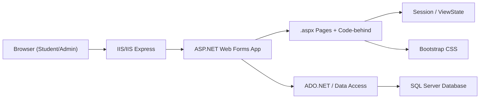
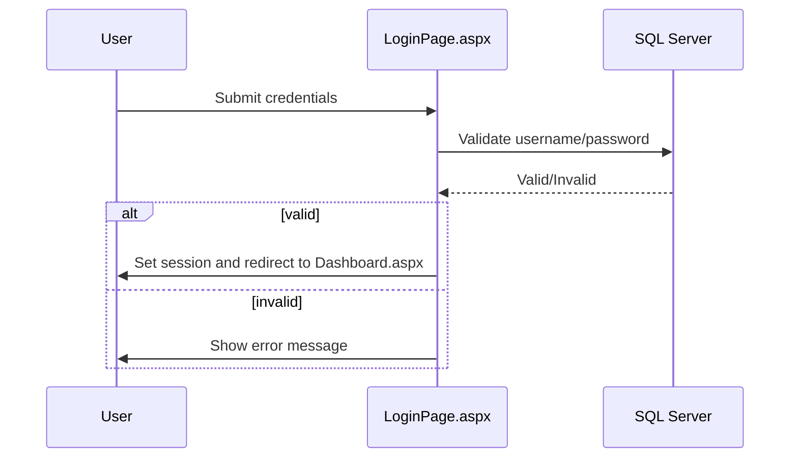
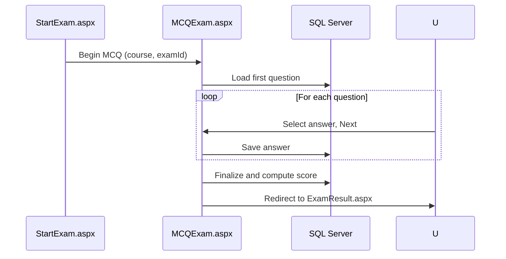
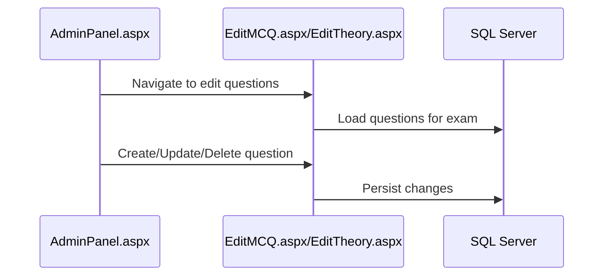
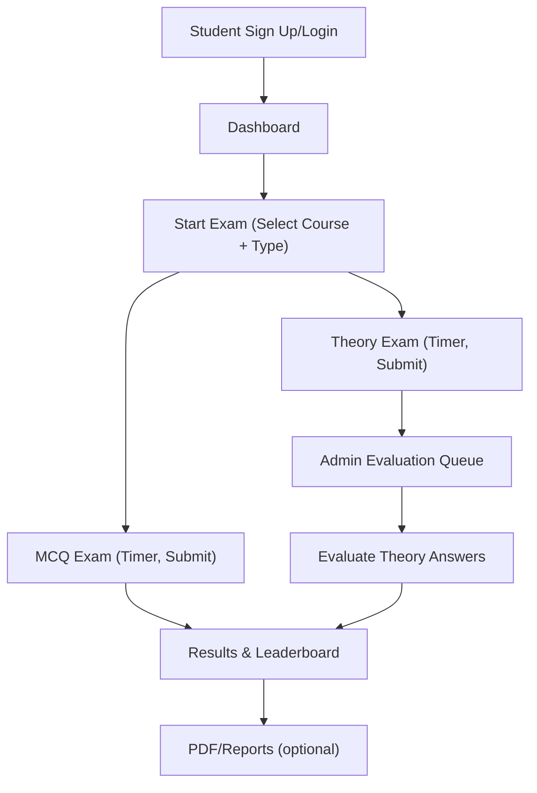

# Online Examination System - Consolidated Documentation

## Introduction
This consolidated document aggregates all project documentation into a single reference for ease of reading and distribution. It combines the Code Document (README), inline comments guidance, XML doc comments guide, project structure, configuration and environment details, interfaces and UI pages, contributing standards, architecture and flows, and business workflows.

Sources: README.md; docs/InlineComments.md; docs/DocstringsGuide.md; docs/ProjectStructure.md; docs/Configuration.md; docs/Interfaces.md; docs/Contributing.md; docs/Architecture.md; docs/BusinessWorkflows.md

## 1. Code Document (Primary README)
### 1.1 Overview and Purpose
The Online Examination System is a monolithic ASP.NET Web Forms application that enables teachers to create and manage exams and allows students to register, take exams (MCQ and theory), and view results. It leverages SQL Server for persistence and Bootstrap for styling, offering administrative features such as leaderboards, exam configuration, question management, and queues for theory answer evaluation.

### 1.2 Features
- User authentication and registration via LoginPage.aspx and SignUpPage.aspx
- Student dashboard (Dashboard.aspx) showing navigation to profile, leaderboard, start exam, etc.
- StartExam flow (StartExam.aspx) with course selection filtered by semester and checks for taken exams
- Multiple Choice (MCQ) exams (MCQExam.aspx) with session-based timing and answer submission
- Theory exams (TheoryExam.aspx) with timers and typed answers
- Results page (ExamResult.aspx) with scoring and profile updates
- Leaderboard (Leaderboard.aspx) for viewing performance
- Admin panel (AdminPanel.aspx) for:
  - Creating/editing exams (SetExam.aspx, EditExam.aspx, EditMCQ.aspx, EditTheory.aspx, MCQSet.aspx, TheorySet.aspx)
  - Managing queues for theory answer evaluation (AdminCourseQueue.aspx/AdminQueue.aspx, ShowAns.aspx)
  - Viewing admin leaderboard (AdminLeaderboard.aspx)
- PDF download stub (DownloadPdf.aspx) for results
- Styling via Bootstrap CSS (CSS/bootstrap.css)
- SQL Server persistence via Web.config connectionStrings

### 1.3 Supported Platforms and Versions
- ASP.NET Web Forms on .NET Framework 4.8
- SQL Server (Express acceptable)
- Visual Studio with IIS Express
- Bootstrap (included via CSS/bootstrap.css; version unspecified)

### 1.4 Installation (Windows)
1) Prerequisites
- Windows 10/11
- Visual Studio (2019 or later, .NET Framework development workload)
- SQL Server or SQL Server Express and SSMS

2) Database Setup
- Execute database-script/Online-Examination-System-Databse-Script.sql in SQL Server.
- Note database name and server for connection strings.

3) Configure Connection Strings (OnlineExamSystem/Web.config)
Example:
```xml
<connectionStrings>
  <add name="dbconnection" connectionString="Data Source=.\SQLEXPRESS;Initial Catalog=OnlineExamDB;Integrated Security=True" providerName="System.Data.SqlClient" />
  <add name="OnlineExamConnectionString" connectionString="Data Source=.\SQLEXPRESS;Initial Catalog=OnlineExamDB;Integrated Security=True" providerName="System.Data.SqlClient" />
</connectionStrings>
```

4) Restore Packages
- Open the solution in Visual Studio and restore NuGet packages if prompted.

### 1.5 Setup and Configuration
- Web.config contains compilation target and connection strings.
- Web.Debug.config and Web.Release.config are provided for transform-based deployment.
- Bootstrap is referenced via CSS/bootstrap.css.

### 1.6 Running the Application
- Visual Studio (IIS Express): Open the solution and press F5.
- IIS: Publish from Visual Studio; ensure app pool targets .NET Framework 4.x and connection strings are configured.

Note: A preview may run on port 3001; IIS Express uses auto-assigned ports locally.

### 1.7 Basic Usage
- Login via LoginPage.aspx; register via SignUpPage.aspx.
- Start Exam via Dashboard.aspx -> StartExam.aspx.
- Take MCQ via MCQExam.aspx; Theory via TheoryExam.aspx.
- View results via ExamResult.aspx and standings via Leaderboard.aspx.
- Admin uses AdminPanel.aspx to create/edit exams and manage queues.

### 1.8 License
- LICENSE file exists; treat it as authoritative. If changing license, update this document and LICENSE accordingly.

## 2. Inline Code Comments Guide
### 2.1 Purpose
Explain “why” over “what” in code-behind and related logic, focusing on non-obvious behavior, constraints, and side effects.

### 2.2 Principles
- Comment around complex logic, session/ViewState usage, SQL assumptions, and timer behavior.
- Use TODO/NOTE/HACK/PERF/SECURITY tags with context.
- Avoid redundant comments.

### 2.3 Web Forms Comment Locations
- Page events (Page_Load, Button_Click)
- Data access routines (ADO.NET)
- Timer and exam lifecycle logic
- Admin workflows

### 2.4 Examples
- PostBack handling in Page_Load
- Parameterized SQL commands
- Timer and session-backed state
- Admin edit flow navigation

(See docs/InlineComments.md for full examples.)

## 3. C# XML Documentation Comments Guide
### 3.1 Purpose and Conventions
Use XML doc comments (<summary>, <param>, <returns>, <exception>, <remarks>, <example>) above classes, methods, and properties to support IntelliSense and maintainability.

### 3.2 Examples
- LoginPage.aspx.cs: btnLogin_Click
- StartExam.aspx.cs: BindCoursesForUser
- MCQExam.aspx.cs: LoadQuestion, SubmitAnswer
- TheoryExam.aspx.cs: SaveCurrentAnswer
- Admin edit pages: CRUD operations with admin preconditions
- Repository/service templates

(See docs/DocstringsGuide.md for code examples.)

## 4. Project Structure
### 4.1 Solution and Project
- OnlineExamSystem.sln with OnlineExamSystem Web Application (.NET Framework 4.8)

### 4.2 Key Layout
- OnlineExamSystem Web Forms root with pages: LoginPage, SignUpPage, Dashboard, StartExam, MCQExam, TheoryExam, ExamResult, Leaderboard, UserProfile, AdminPanel, AdminLeaderboard, AdminCourseQueue/AdminQueue, SetExam, EditExam, EditMCQ, EditTheory, MCQSet, TheorySet, ShowAns, TakenCourses, DownloadPdf.
- Web.config, Web.Debug.config, Web.Release.config
- CSS/bootstrap.css
- Properties/AssemblyInfo.cs
- Images/, packages.config, bin/, obj/
- database-script with SQL script
- images with screenshots
- packages with NuGet content
- LICENSE

### 4.3 Template Extensions
- App_Code, Models, Services, Repositories (if added) must be documented.

### 4.4 TODOs
- Keep page list updated; add master pages/user controls if introduced.

## 5. Configuration and Environment
### 5.1 Required Software
Windows, Visual Studio, .NET Framework 4.8, SQL Server/Express, SSMS, IIS Express/IIS.

### 5.2 Dependencies
- ASP.NET Web Forms targeting .NET Framework 4.8
- Bootstrap (CSS/bootstrap.css)
- NuGet: Microsoft.CodeDom.Providers.DotNetCompilerPlatform (1.0.0), Microsoft.Net.Compilers (1.0.0)
- CrystalDecisions.Web reference present (ensure runtime if used)

### 5.3 Config Files
- Web.config (compilation, httpRuntime, connectionStrings)
- Web.Debug.config, Web.Release.config (transforms)
- packages.config

### 5.4 Environment and Secrets
- No required environment variables.
- For future secrets, use transforms, IIS environment, or aspnet_regiis encryption.

### 5.5 Database Initialization
- Use database-script/Online-Examination-System-Databse-Script.sql
- Validate schema (users, exams, questions, answers, results).

### 5.6 Ports
- Local IIS Express uses auto-assigned port; preview may target 3001.

## 6. Interfaces and UI Pages
### 6.1 User Pages
- LoginPage.aspx, SignUpPage.aspx, Dashboard.aspx, StartExam.aspx, MCQExam.aspx, TheoryExam.aspx, ExamResult.aspx, Leaderboard.aspx

### 6.2 Admin Pages
- AdminPanel.aspx, SetExam.aspx, EditExam.aspx, EditMCQ.aspx, EditTheory.aspx, MCQSet.aspx, TheorySet.aspx, AdminCourseQueue.aspx/AdminQueue.aspx, ShowAns.aspx, AdminLeaderboard.aspx

### 6.3 Download PDF
- DownloadPdf.aspx has a code-behind placeholder for future PDF generation.

### 6.4 WebMethods/Handlers Template
Document any [WebMethod]/handler with path, method, inputs, outputs, and errors.

(See docs/Interfaces.md for details.)

## 7. Contributing and Extension Guidelines
### 7.1 Workflow
Branching, focused commits, PRs with clear descriptions and test steps.

### 7.2 Coding Standards
C# naming, input validation, parameterized SQL, ViewState/Session management best practices.

### 7.3 Adding Features
Create new pages, update navigation, use Bootstrap, and update docs. Handle data model changes via SQL scripts and document them.

### 7.4 Submitting Changes
Ensure build success, perform manual tests, format code, review security.

### 7.5 Testing and Documentation
Manual test critical flows; keep documentation and screenshots updated.

### 7.6 Deployment
Use Web.config transforms; verify IIS app pool and DB permissions.

## 8. Architecture and Flow
### 8.1 High-Level Architecture
Monolithic Web Forms with UI pages, business logic in code-behind or services, ADO.NET data access, SQL Server persistence, Bootstrap styling.

### 8.2 Component Diagram


### 8.3 Data Flow
- Authentication and dashboard (sequence)
- MCQ exam lifecycle (sequence)
- Admin question management (sequence)







### 8.4 Design Considerations
ViewState/postbacks, session management, timer handling, security, and PDF generation placeholder.

### 8.5 Future Enhancements
Services/Repositories, centralized auth, optional Web API endpoints, timer robustness.

## 9. Business Workflows
### 9.1 Overview
Roles: Student and Admin/Teacher. Systems: Web Forms UI, SQL Server, Bootstrap. See related docs for architecture and interfaces.

### 9.2 High-Level Workflow Map


### 9.3 Student Workflows
Registration/login, starting exam, taking MCQ/theory exams, viewing results and leaderboard, with preconditions, exceptions, and touchpoints.

### 9.4 Admin Workflows
Exam setup and question management, theory answer evaluation queue, leaderboard oversight and reporting.

### 9.5 SOPs
- Create a new exam
- Conduct an MCQ exam
- Evaluate theory answers

### 9.6 Exceptions and KPIs
Authentication failures, retake policies, timer expiry handling, data integrity; KPIs including participation, completion, average score, evaluation SLA, and leaderboard distribution.

### 9.7 RACI
Student (Responsible for attempts), Admin/Teacher (Responsible and Accountable for setup/evaluation), System (Consulted/Informed via logs and dashboards).

## 10. Cross-References and Maintenance
- Keep this document synchronized with individual docs under docs/.
- Update sections when pages or workflows change.
- For environment-specific settings, also update Configuration and Web.config transforms.

## 11. Appendices
### 11.1 Links
- Root README: ../README.md
- Docs Index: README.md
- Architecture: Architecture.md
- Configuration: Configuration.md
- Interfaces: Interfaces.md
- Inline Comments: InlineComments.md
- XML Docstrings: DocstringsGuide.md
- Project Structure: ProjectStructure.md
- Contributing: Contributing.md
- Business Workflows: BusinessWorkflows.md

### 11.2 TODO Placeholders
- Confirm final Bootstrap version and document.
- Provide concrete connection strings per environment (Dev/Test/Prod).
- Update with master pages or user controls if added.
