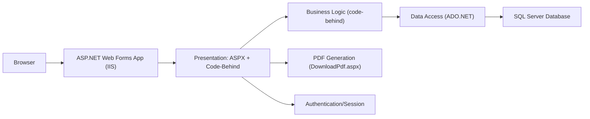
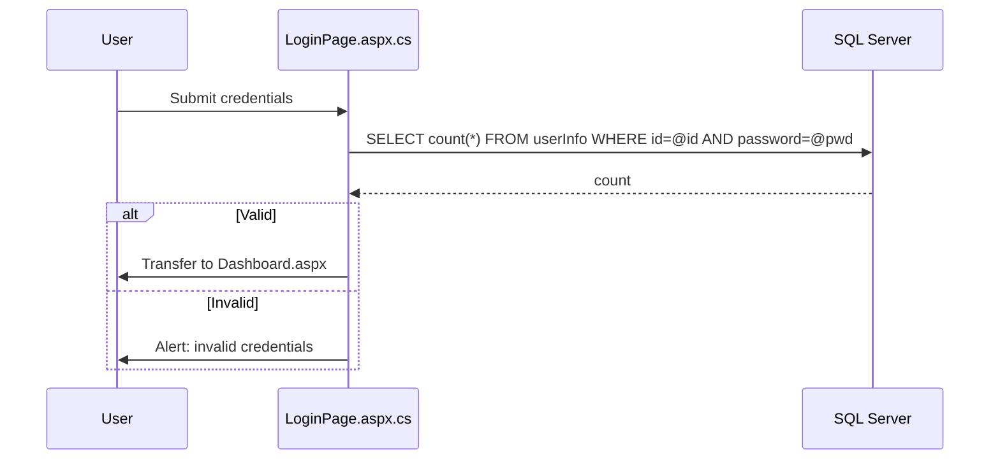
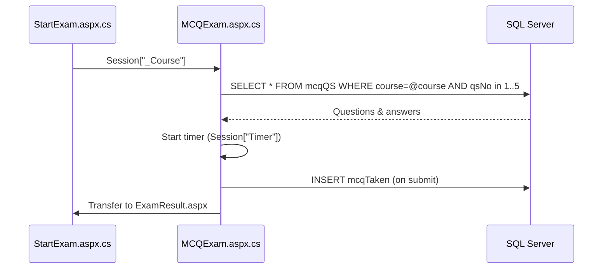

# System Architecture and Data Flow

## Overview
The Online Examination System is a monolithic ASP.NET Web Forms application. It renders HTML via .aspx pages and manages interactions through server-side event handlers in code-behind files. State is managed by Session and page controls (ViewState). The application connects to SQL Server using ADO.NET.

## Project Structure (Extracted)
Actual directories and key files under OnlineExamSystem:
- Web.config, Web.Debug.config, Web.Release.config
- Pages:
  - LoginPage.aspx(.cs/.designer.cs)
  - SignUpPage.aspx(.cs/.designer.cs)
  - Dashboard.aspx(.cs/.designer.cs)
  - StartExam.aspx(.cs/.designer.cs)
  - MCQExam.aspx(.cs/.designer.cs)
  - TheoryExam.aspx(.cs/.designer.cs)
  - ExamResult.aspx(.cs/.designer.cs)
  - Leaderboard.aspx(.cs/.designer.cs)
  - UserProfile.aspx(.cs/.designer.cs)
  - AdminPanel.aspx(.cs/.designer.cs)
  - SetExam.aspx(.cs/.designer.cs)
  - MCQSet.aspx(.cs/.designer.cs)
  - TheorySet.aspx(.cs/.designer.cs)
  - EditExam.aspx(.cs/.designer.cs)
  - EditMCQ.aspx(.cs/.designer.cs)
  - EditTheory.aspx(.cs/.designer.cs)
  - AdminQueue.aspx(.cs/.designer.cs)
  - AdminCourseQueue.aspx(.cs/.designer.cs)
  - AdminLeaderboard.aspx(.cs/.designer.cs)
  - ShowAns.aspx(.cs/.designer.cs)
  - DownloadPdf.aspx(.cs/.designer.cs)
- CSS/bootstrap.css
- Properties/AssemblyInfo.cs
- packages.config

## Logical Components
- Presentation (Web Forms)
  - .aspx pages and server controls
  - Code-behind for events (Page_Load, Button_Click, Timer_Tick)
- Business Logic
  - Embedded in page code-behind; candidates to extract into helper classes
- Data Access
  - Inline ADO.NET SqlConnection/SqlCommand in pages
- Database (SQL Server)
  - Tables: userInfo, mcqQS, mcqTaken, theoryQS, theoryAns, theoryTaken, theoryCourseQueue, theoryQueue (inferred from code)
- PDF Generation
  - DownloadPdf.aspx shows scaffold with iTextSharp (currently commented)
- Authentication/Authorization
  - LoginPage: checks userInfo for students; Admin/Admin for teacher/admin

## Deployment View
- IIS/IIS Express hosts the ASP.NET Web Forms application
- Application pool targeting .NET Framework v4.x (project targets 4.8)
- SQL Server accessible via configured connection strings

## Architecture Diagrams

### ASCII Component View
[Browser]-->[IIS/ASP.NET Web Forms App]
                 |
                 +-- Presentation (ASPX + Code-Behind)
                 |      - Login, Dashboard, Exams, Admin pages
                 |
                 +-- Business Logic (in code-behind)
                 |      - Exam creation, evaluation, leaderboard
                 |
                 +-- Data Access (ADO.NET)
                 |      - SqlConnection/SqlCommand
                 |
                 +-- PDF (DownloadPdf.aspx scaffold)
                 |
                 +-- SQL Server Database
                        - userInfo, mcqQS, mcqTaken
                        - theoryQS, theoryAns, theoryTaken
                        - theoryCourseQueue, theoryQueue

### Mermaid Component Diagram

## Data Flow

### Login Sequence (Student)
1. Browser requests LoginPage.aspx
2. On loginButton_Click:
   - Validate credentials via userInfo (ADO.NET)
   - On success: set Session["_ID"], navigate to Dashboard.aspx
   - On failure: alert user

### Create Exam (Admin)
- AdminPanel -> SetExam/MCQSet/TheorySet
- Admin adds questions to mcqQS/theoryQS
- Admin edits via EditExam/EditMCQ/EditTheory

### Taking MCQ Exam
1. StartExam selects course and type, sets Session["_Course"]
2. MCQExam Page_Load loads qs 1..5 for the course into controls, stores answers in Session, initializes timer
3. On submitB_Click:
   - Compare answers, compute mark
   - Insert into mcqTaken
   - Session["_tMark"] = mark
   - Transfer to ExamResult.aspx

### Taking Theory Exam
- Loads pairs of questions per qsNo sequentially (1..5)
- On submission:
  - Inserts five rows into theoryAns
  - Inserts into theoryCourseQueue and theoryQueue
  - Inserts into theoryTaken
  - Transfers to Dashboard

### Evaluation and Leaderboard
- AdminQueue/AdminCourseQueue show pending theory evaluations; ShowAns.aspx presents answers for marking and approval
- Leaderboard.aspx retrieves and displays rankings across taken exams

## Configuration and Environment
- See README for detailed steps
- Web.config:
  - targetFramework 4.8 compilation; httpRuntime 4.5.2
  - connectionStrings placeholders
- Transforms:
  - Web.Debug.config and Web.Release.config present (standard transform scaffolding)

## Security Considerations
- Replace inline SQL with parameterized queries to mitigate SQL injection
- Strengthen session checks and restrict admin pages
- Consider using Forms Authentication and Roles if extending

## Extensibility
- Extract Data Access layer into App_Code for reuse and testing
- Add PDF generation using iTextSharp or modern alternatives
- Introduce repository/services for cleaner separation of concerns
- Add WebMethods/PageMethods for AJAX-based interactions if needed

