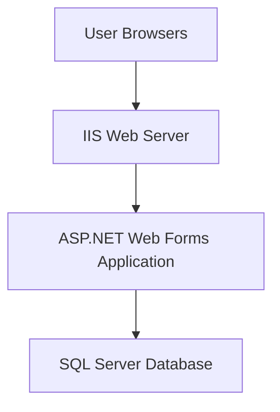

# Architecture

## System Context
The system is a monolithic ASP.NET Web Forms application deployed on IIS, serving HTML to browsers. Data is persisted in SQL Server.

## Technology Stack
- Frontend: ASP.NET Web Forms, Bootstrap CSS
- Backend: C# .NET Framework 4.8 (Web Forms code-behind pattern)
- Data: SQL Server with ADO.NET access
- DevOps/Infra: IIS, .NET tooling, NuGet packages for compiler/CodeDom providers

## Architectural Views
### Logical View
- UI Pages: Login, SignUp, Dashboard, StartExam, MCQExam, TheoryExam, AdminPanel, AdminQueue, AdminCourseQueue, Leaderboard, ExamResult, EditExam, MCQSet, TheorySet, EditMCQ, EditTheory, DownloadPdf.
- Core Services: Authentication, Exam delivery (MCQ/Theory), Results & Leaderboards, Admin content and queue management.
- Data Access: Direct SQL via SqlCommand/SqlDataAdapter.

### Process View
- Each request handled by ASP.NET pipeline; state maintained via Session.
- Timers implemented via ASP.NET Timer/UpdatePanel with server-side time stored in Session["Timer"].

### Deployment View

## Data Architecture
- Tables include userInfo, mcqQS, theoryQS, mcqTaken, theoryTaken, theoryAns, theoryQueue, theoryCourseQueue.
- Keys and indices should be added for studentID, courseID, examNo, qsNo to ensure performance.

## Security Architecture
- Authentication: Forms-style login, session-based authorization.
- Input Validation: Must transition to parameterized SQL; sanitize strings.
- Secrets: Connection strings maintained in Web.config; use secure credentials; avoid placeholders in production.

## Integration Points
- None external; all operations are within the monolith and SQL Server. Optional PDF generation uses local library (currently commented).

## Quality Attributes and Tactics
- Performance: Query optimization and connection management.
- Scalability: Vertical scaling on IIS; horizontal with sticky sessions and shared SQL.
- Availability: IIS app pool recycling strategy; DB backup/restore.
- Maintainability: Refactor to shared data access utilities; enforce coding conventions.

## Known Limitations in Current Code
- SQL concatenation risks injection.
- Timer logic relies on Session strings and multiple opens/closes per request.
- Admin auth is hardcoded.

## References
- Web.config, OnlineExamSystem.csproj, representative ASPX code-behind, SQL database script.
