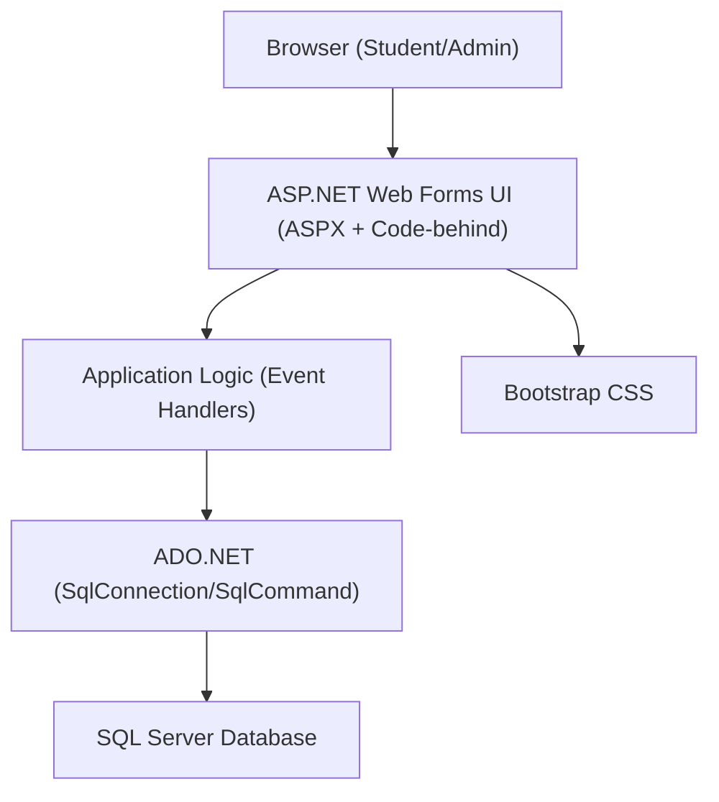
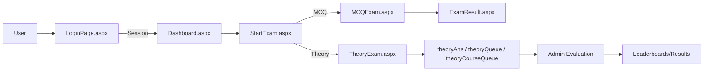

# High-Level Design (HLD)

## Overview
The Online Examination System is implemented as a monolithic ASP.NET Web Forms application. Server-rendered ASPX pages communicate with a SQL Server database via ADO.NET. Bootstrap is used for styling. The system is hosted on IIS.

## Architecture
- Presentation Layer: ASPX pages with code-behind in C# (e.g., LoginPage.aspx.cs, StartExam.aspx.cs, MCQExam.aspx.cs, TheoryExam.aspx.cs).
- Application Logic: Event handlers in code-behind manage navigation, session, DB access, question loading, marking, and queueing.
- Data Layer: Direct ADO.NET usage with SqlConnection/SqlCommand, interacting with SQL Server tables defined in the script.
- Infrastructure: IIS hosting, Web.config for configuration and connectionStrings, .csproj references for .NET Framework and packages.

## Major Components and Responsibilities
- Authentication: LoginPage.aspx(.cs) authenticates students; admin login via static credentials (to be hardened).
- Registration: SignUpPage.aspx(.cs) writes user records to userInfo and uploads image assets.
- Student Dashboard and Exam Start: Dashboard.aspx(.cs), StartExam.aspx(.cs) drive course discovery by semester and exam selection.
- MCQ Exam Engine: MCQExam.aspx(.cs) loads questions, tracks timer, computes marks, and persists mcqTaken.
- Theory Exam Engine: TheoryExam.aspx(.cs) loads paired questions, tracks timer, persists theoryAns, queues for evaluation, and records theoryTaken.
- Admin/Teacher Panel: AdminPanel.aspx(.cs), MCQSet.aspx(.cs), TheorySet.aspx(.cs), EditMCQ.aspx(.cs), EditTheory.aspx(.cs), AdminQueue/AdminCourseQueue.aspx(.cs) to manage content and queues.
- Results & Leaderboards: ExamResult.aspx(.cs) and Leaderboard.aspx(.cs) present outcomes and ranking.

## Data Flows
- User Registration: Form -> userInfo insert -> redirect to login.
- Login: Credentials -> userInfo count check -> session set -> redirect to dashboard.
- Start Exam: Session semester -> populate courses -> check questions exist -> route to exam page.
- MCQ Exam: Fetch mcqQS 1-5 -> store correct answers in session -> submit -> compute mark -> mcqTaken insert -> show results.
- Theory Exam: Fetch theoryQS pairs -> submit -> insert theoryAns, insert theoryQueue/theoryCourseQueue, insert theoryTaken -> confirmation.
- Leaderboard: Query aggregated marks and render grid.

## High-Level Diagram (Component)

## High-Level Diagram (Data Flow)

## Cross-Cutting Concerns
- Session Management: Checked on exam pages; improve null checks and redirects.
- Timing: Timers rely on server-side DateTime in Session; ensure consistent time authority.
- Security: Replace string concatenation with parameterized SQL; safeguard admin routes.

## Technology Choices
- ASP.NET Web Forms for rapid server-rendered development.
- SQL Server for relational persistence.
- Bootstrap for UI styling.

## References
- OnlineExamSystem.csproj, Web.config, representative ASPX code-behind files, SQL database script, repository README.
