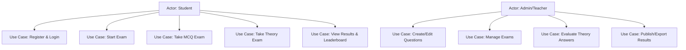
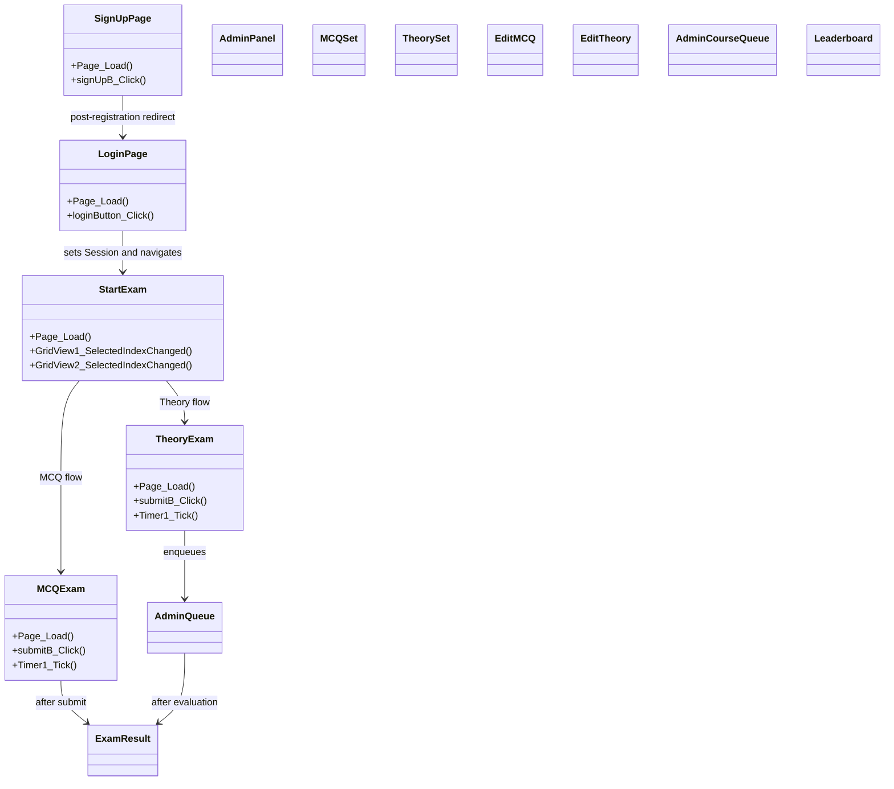
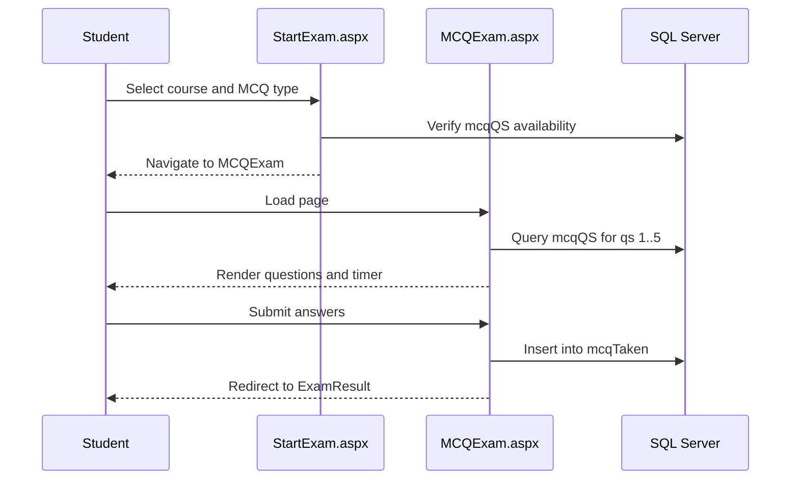
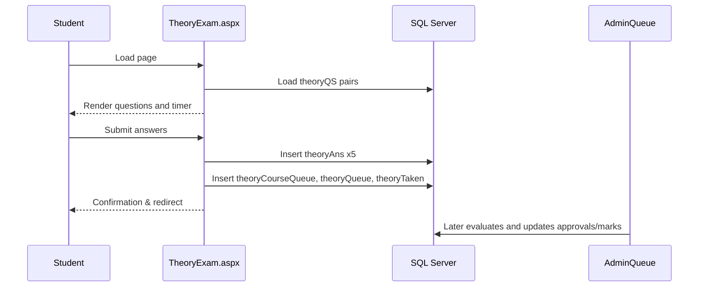
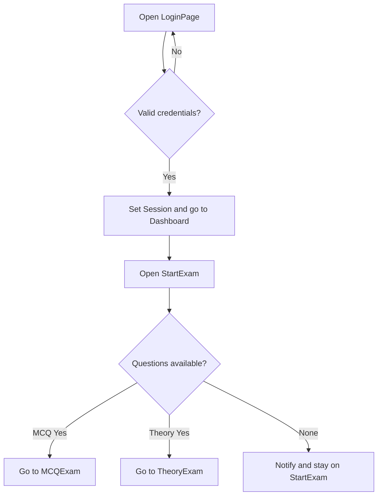
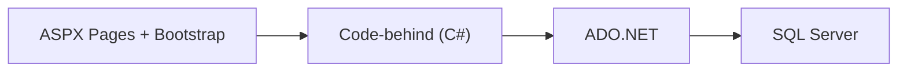
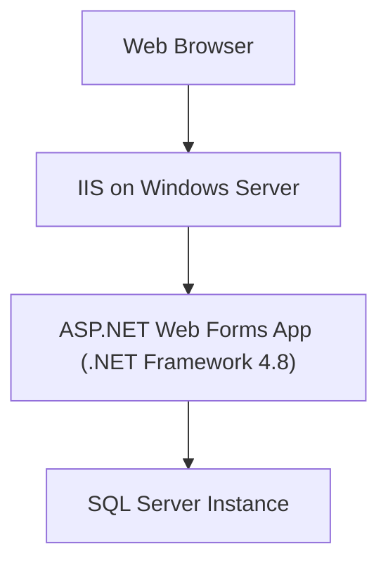

# UML Diagrams and Explanations

## Use Case Diagram (Textual)

## Class Diagram (Simplified logical view)

## Sequence Diagram: MCQ Exam Flow

## Sequence Diagram: Theory Exam Submission

## Activity Diagram: Login and Exam Start

## Component Diagram

## Deployment Diagram

## Explanations
- The use case diagram highlights distinct user goals for students and admins.
- The class diagram shows page-level classes with their key handlers and navigation relationships.
- Sequence diagrams detail the runtime interactions during MCQ and theory exam flows.
- The activity diagram shows decisions during login and exam initiation.
- Component and deployment diagrams illustrate the layered architecture and runtime topology.

## References
- Code-behind pages: LoginPage.aspx.cs, SignUpPage.aspx.cs, StartExam.aspx.cs, MCQExam.aspx.cs, TheoryExam.aspx.cs, Admin*.aspx.cs
- Web.config and project file for platform and dependencies
- SQL schema script for data structures
