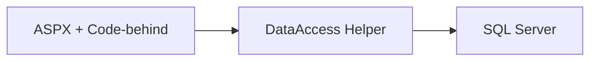
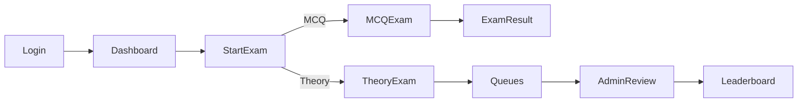

# Software Design Description (SDD) / Technical Specification

## To-Be Design
The system will remain a monolithic ASP.NET Web Forms app in the near term but will be hardened for security and performance:
- Data access refactored to parameterized SqlCommand usage with helper methods for query/command execution.
- Session utilities to standardize checks and redirect behavior.
- Improved timer handling using server-side time stored as DateTime in Session, with read-only client updates.

## Implementation Strategy
1. Introduce a DataAccess helper class (App_Code/DataAccess.cs) encapsulating:
   - GetConnection()
   - ExecuteScalar(string sql, params)
   - ExecuteNonQuery(string sql, params)
   - ExecuteReader(string sql, params)
2. Migrate pages from concatenated SQL to parameterized form.
3. Introduce AuthHelper (App_Code/AuthHelper.cs) for:
   - EnsureStudentSession()
   - EnsureAdminSession()
   - Logout()
4. Centralize configuration keys:
   - connectionStrings["OnlineExamConnectionString"]
   - appSettings for constants (e.g., ExamDefaults)

## Scalability Considerations
- Enable IIS output caching for static resources and partial caching for read-only pages where feasible.
- Use SQL indexing on high-traffic columns (studentID, courseID, qsNo, examNo).
- Consider background processing for heavy queue evaluations if volumes grow.

## Performance Considerations
- Reduce repeated open/close cycles; reuse connections within a request scope using using blocks.
- Batch queries where possible for loading multiple questions.
- Prefer stored procedures for complex data access.

## Security Considerations
- Parameterize all SQL; hash and salt passwords (e.g., PBKDF2).
- Validate and sanitize all inputs; limit file upload types and sizes; generate unique file names.
- Secure admin features with proper role-based authentication.
- Store connection strings securely; do not commit secrets.

## Maintainability Considerations
- Encapsulate course-to-name mapping in a configuration table instead of inline logic.
- Extract constants for semesters and courses to tables and bind UI controls from DB.
- Apply code-behind conventions for readability and consistency.

## Sample Code Changes (Illustrative)
### Login parameterization refactor (conceptual)
```csharp
using (var con = new SqlConnection(ConfigurationManager.ConnectionStrings["OnlineExamConnectionString"].ConnectionString))
using (var cmd = new SqlCommand("SELECT COUNT(*) FROM userInfo WHERE id=@id AND password=@pwd", con)) {
    cmd.Parameters.AddWithValue("@id", userTextBox.Text);
    cmd.Parameters.AddWithValue("@pwd", passTextBox.Text);
    con.Open();
    var count = (int)cmd.ExecuteScalar();
    if (count == 1) { /* set session, redirect */ }
}
```

### MCQ question batch loading (conceptual)
```csharp
using (var con = new SqlConnection(cs))
using (var cmd = new SqlCommand("SELECT qsNo, qs, op1, op2, op3, op4, ans, tag, eTime FROM mcqQS WHERE course=@course AND qsNo BETWEEN 1 AND 5 ORDER BY qsNo", con)) {
    cmd.Parameters.AddWithValue("@course", crs);
    con.Open();
    using (var rdr = cmd.ExecuteReader()) {
        while (rdr.Read()) {
            // map to controls and Session based on qsNo
        }
    }
}
```

## Diagrams
### Data Access Refactor Component


### Examination Flow (Refined)


## Testing Strategy
- Unit tests for DataAccess and AuthHelper.
- Integration tests for login, MCQ submit, theory submit, leaderboard queries.
- Security tests for SQL injection attempts and session handling.
- Load testing for exam submission peak.

## Deployment and Environments
- Dev: Local IIS Express or IIS with dev DB.
- Staging: IIS with staging DB; test credentials and data.
- Production: Hardened IIS site with SSL, restricted DB user, monitoring.

## Open Issues
- Establish admin user provisioning flow (replace hardcoded Admin/Admin).
- Formalize PDF export feature or remove placeholder.

## References
- Web.config, OnlineExamSystem.csproj, MCQExam.aspx.cs, TheoryExam.aspx.cs, StartExam.aspx.cs, LoginPage.aspx.cs, SignUpPage.aspx.cs, SQL database script, project README.
